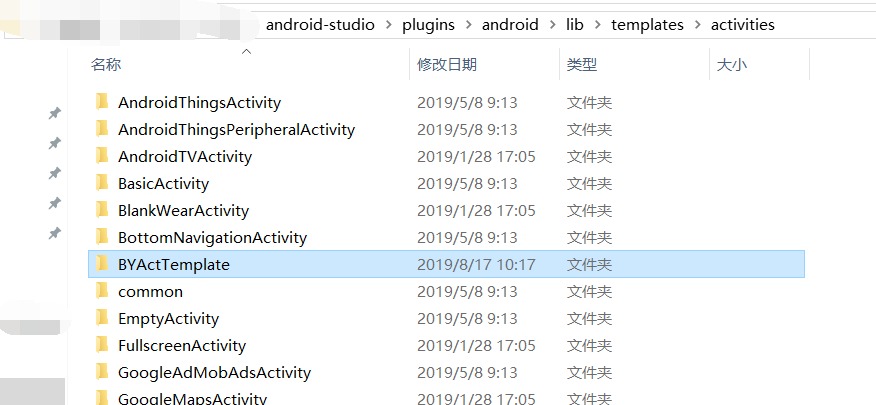
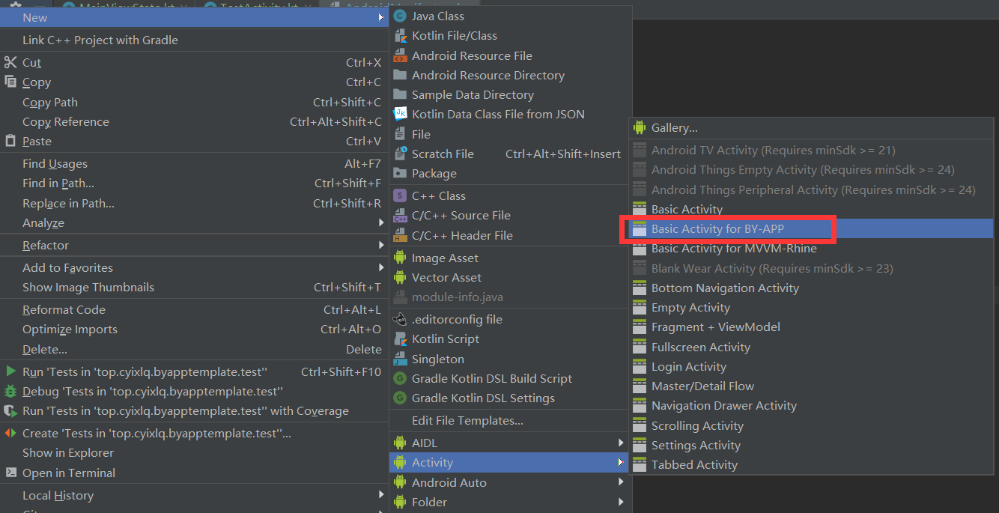

# BY_APP_Template-Template

[BY_APP_TEMPLATE](https://github.com/cyixlq/BY_APP_TEMPLATE)代码模板，一键生成所有kt模板代码，节省键盘寿命。争取早点完工早点下班！

## Usage

1.将项目对应的模版存放于 AndroidStudio - plugins - android - lib - templates - activities/other 目录下:
* BYActTemplate -> activities
* BYFrgTemplate -> other

2.新建Activity/Fragment时，通过AndroidStudio的模板新建系列文件（如下图所示）：

3.新建成功，AndroidStudio 同步完成后即可开始码代码。
